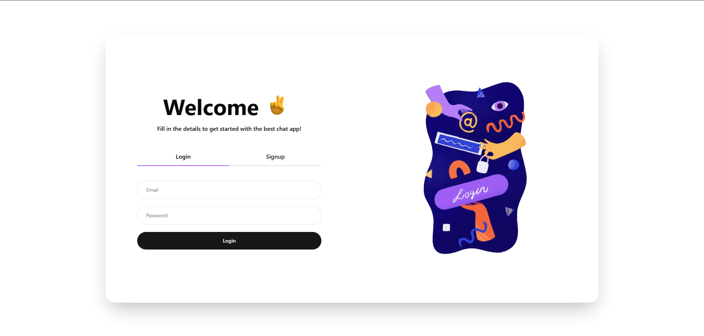
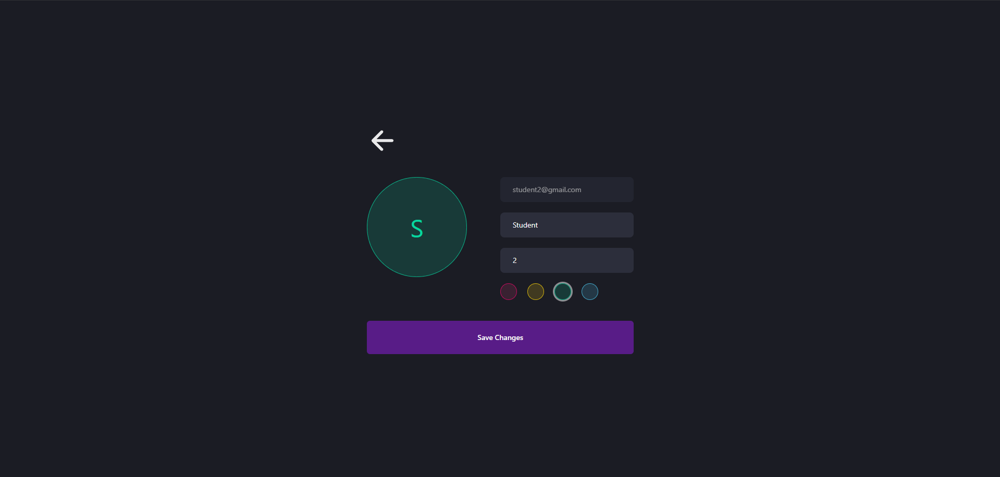
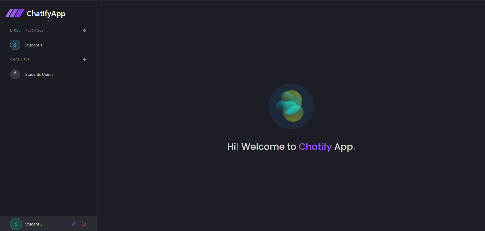
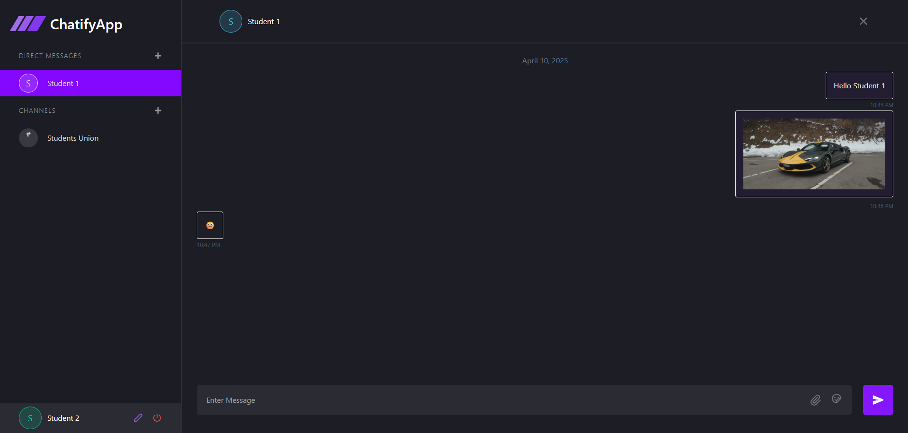
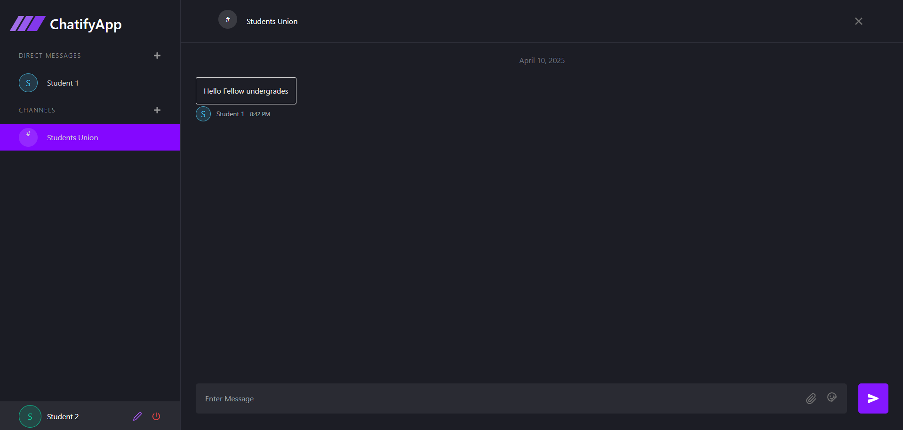

# ⚡ Real-Time Chat Application

A full-stack real-time chat application built with **React**, **Express**, **Socket.IO**, and **MongoDB**. This app supports user authentication, private messaging, channel-based chats, file uploads, and a sleek modern UI.

---

## 📁 Project Structure

```
.
├── client/   # Frontend built with React + Vite
├── server/   # Backend with Express, MongoDB, Socket.IO
```

---

## 🚀 Features

### ✅ Core Functionalities

- Real-time messaging with **Socket.IO**
- User authentication (Signup, Login, Logout) using **JWT**
- Channel creation and group chat support
- Upload and preview media files via **Multer**
- Display relative timestamps using **Moment.js**
- Persistent user sessions with **cookies**
- RESTful API endpoints using **Express**
- Search & list contacts for DM
- Animated UI components and emoji support

---

## 🛠️ Technologies Used

### Client (`client/`)

- **React 18** with **Vite**
- **Tailwind CSS** + **tailwindcss-animate** for styling
- **React Router v7**
- **Socket.IO Client**
- **Axios** for HTTP requests
- **Zustand** for global state management
- **Emoji Picker**, **React Lottie**, **Radix UI**, **Lucide Icons**
- **Moment.js** for timestamps

### Server (`server/`)

- **Node.js**, **Express.js**
- **MongoDB** with **Mongoose**
- **JWT** for secure authentication
- **Multer** for file uploads
- **Socket.IO** for real-time chat
- **CORS**, **Cookie Parser**, **dotenv**

---

## 🧪 Getting Started

### 1. Clone the Repository

```bash
git clone https://github.com/your-username/chat-app.git
cd chat-app
```

### 2. Setup Server

```bash
cd server
npm install
```

Create a `.env` file:

```env
PORT=8000
JWT_KEY=your_secret_jwt_key
ORIGIN=http://localhost:5173
DATABASE_URL=your_mongodb_uri
```

Start the backend:

```bash
npm run dev
```

### 3. Setup Client

```bash
cd ../client
npm install
```

Create a `.env` file:

```env
VITE_SERVER_URL=http://localhost:8000
```

Start the frontend:

```bash
npm run dev
```

---

## 🌐 Deployment Notes

If you're deploying to platforms like **Vercel**:

- Make sure the **CORS settings** in your Express backend allow your deployed frontend URL.
- Set the correct environment variables in Vercel's dashboard for both frontend and backend.
- Use `withCredentials: true` in Axios and `credentials: true` in Express CORS middleware if using cookies.

---

## 📸 Screenshots










---

## 🤝 Contributing

Pull requests are welcome. For major changes, please open an issue first to discuss what you would like to change.

---

## 📄 License

This project is licensed under the MIT License.

---

## ✨ Author

- Pavitra Virani - Krish Dobariya(https://github.com/virani-pavitra  ||  github.com/krishpatel07)
